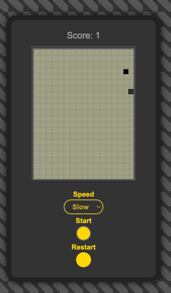

# snake
# Snake Game in WebGL

A simple Snake game implemented in WebGL. This project uses Object-Oriented Programming (OOP) principles to make it easy to modify and expand.

## Project Structure

plaintext
Copy code
/snake-game
├── dist/                     // Project build
├── src/                      // Source code
│   ├── index.html            // Main HTML file
│   ├── styles.less           // Main stylesheet (LESS)
│   ├── main.js               // Entry point, launches the game
│   ├── Game.js               // Game class
│   ├── Snake.js              // Snake class
│   ├── Food.js               // Food class
│   ├── Grid.js               // Game grid class
│   ├── InputHandler.js       // Input handling class
│   └── Renderer.js           // WebGL rendering class
├── assets/                   // Assets folder (images, textures)
├── webpack.config.js         // Webpack configuration
└── package.json              // Project description and dependencies

# Installation
Clone the repository

Navigate to the project folder:
cd snake
Install the dependencies:

npm install
Scripts
npm start - Launches a development server with Webpack Dev Server.
npm run build - Builds the project for production in the dist folder.
Technologies Used
JavaScript (ES6) - for game logic and modular structure.
WebGL - for rendering the snake and objects.
Webpack - for bundling and dependency management.
LESS - for styling and easier CSS management.
Getting Started
Start the project in development mode:

npm start
Open your browser and go to http://localhost:9000 to see the game.

To create a production build, run:

npm run build
After building, open dist/index.html in your browser to test the production version.

Future Improvements
Adding difficulty levels.
Optimizing rendering with WebGL.
Enhancing animation and graphics.
Adding support for mobile devices.
License
MIT